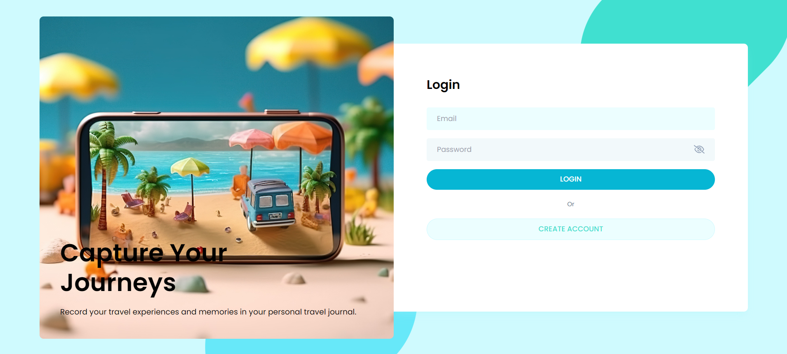
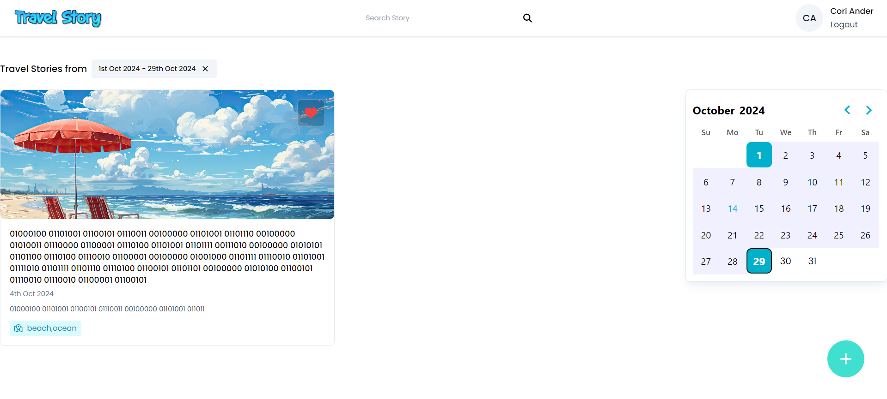

---

**Travel App Overview**

This travel app provides a platform for users to explore, document, and share their travel adventures through an intuitive interface. It offers several key features, including:

- **User Authentication**: Secure user sign-up and login with hashed passwords, ensuring strong authentication and data protection.
- **Content Sharing**: Users can upload pictures, share travel stories, and ideas, creating a community of explorers.
- **Favorites**: Mark stories as favorites for easy access to preferred content.
- **Search and Filtering**: Users can filter stories by keywords, tags, and date range, ensuring relevant content discovery.
- **Responsive Design**: The app is fully responsive, delivering an optimized experience across desktops, tablets, and mobile devices.
- **User Profiles**: Personalized user profiles allow users to manage their shared content and favorites efficiently.
- **Feedback Messages**: Dynamic messages guide users during the authorization and upload processes, improving overall usability.
- **Performance Optimizations**: Features like lazy loading for images and optimized API calls ensure fast loading times and a smooth user experience.
- **Real-time Features**: Live notifications and updates create a dynamic user experience, ensuring users stay informed on their favorite content.
- **Scalability**: Designed for scalability, the app can handle an increasing number of users and content as it grows.
- **Deployment**: Hosted on [AWS/Heroku], with efficient deployment pipelines ensuring easy updates and scalability.

**Tech Stack**

- **Frontend**: Built using React for a responsive and dynamic user interface.
- **Backend**: Node.js with Express handles server-side logic, and MongoDB manages the database.
- **Security**: JSON Web Tokens (JWT) are used for secure user authentication.
- **Media Handling**: Efficient file uploads allow users to share high-quality images.
- **Tools**: Moment.js for date handling and search filtering, ensuring seamless user interaction with date-based content.
- **Hosting**: The app is hosted on [AWS/Heroku], with CI/CD pipelines ensuring smooth deployments.

---

## Reflecting on My Learning Journey in Full-Stack Development
#### MongoDB:
**Learning**: The flexibility of MongoDB allows for rapid prototyping and iterative development, which is particularly beneficial in the early stages of project development. However, I also realized that careful planning is necessary to ensure data integrity and efficient querying as the application scales.

#### Express.js:
**Learning**: The use of middleware in Express.js taught me the importance of separating concerns in my application. By modularizing functionality, I was able to maintain cleaner code and enhance the overall structure of my projects.

#### React:
**Learning**: Understanding the lifecycle of components in React has significantly improved my ability to handle asynchronous data fetching and rendering. The `useEffect` hook, in particular, enabled me to synchronize my components with external data sources seamlessly.

#### Node.js:
**Learning**: The event-driven architecture of Node.js has enhanced my understanding of handling concurrent requests. This knowledge has been crucial in optimizing performance, particularly in applications that require real-time updates.

#### State Management with React Hooks

One of the most significant challenges was managing component state effectively. In React, the `useState` hook provides a way to declare state variables, while `useEffect` allows for side effects such as data fetching. I initially struggled with understanding how to structure my components and manage their state. However, through practice and experimentation, I became proficient in handling asynchronous data, which was crucial for retrieving user information and notes through API calls.

**Learning**: The importance of understanding the relationship between state and UI rendering became clear to me. I learned that inefficient state management can lead to performance issues and a poor user experience. Therefore, mastering the use of hooks has been a key focus in my learning journey.

#### API Integration with Axios

Integrating RESTful APIs using Axios was another critical aspect of my learning process. Axios allowed me to handle HTTP requests seamlessly, and I learned how to manage authentication headers to secure my API endpoints. I gained valuable experience in configuring Axios instances and managing errors related to authorization.

**Learning**: Effective error handling is essential in any application that relies on external data sources. I learned to implement strategies for handling failures, which significantly improved the user experience by providing clear return messages.

#### Form Handling and Validation

Creating a user-friendly UI for adding and editing notes challenged my form management skills. I implemented validation logic to ensure data integrity, which required a deeper understanding of both frontend and backend interactions. The validation process taught me how to provide immediate feedback to users, enhancing the overall usability of my application.

**Learning**: The importance of user experience in form design became evident. Ensuring that forms are intuitive and provide clear validation messages is crucial for maintaining user engagement and preventing frustration.

#### Error Handling and Debugging

A significant challenge arose when I encountered a bug that caused duplicate requests in my application. This experience refined my understanding of the `useEffect` dependencies and the importance of cleanup functions. I learned to carefully analyze the flow of data and component lifecycle to identify the root cause of issues.

**Learning**: Debugging is an essential. I realized that a methodical approach to identifying and resolving bugs can lead to improved app performance and efficient network usage.

### UI Modals and Reusability

Implementing reusable modals for adding and editing notes taught me the value of keeping code modular and clean. By creating generic modal components, I was able to enhance the maintainability of my codebase and reduce redundancy.

**Learning**: The concept of reusability is crucial in software development. Building components that can be reused across different parts of the application not only saves time but also promotes consistency in design and functionality.
